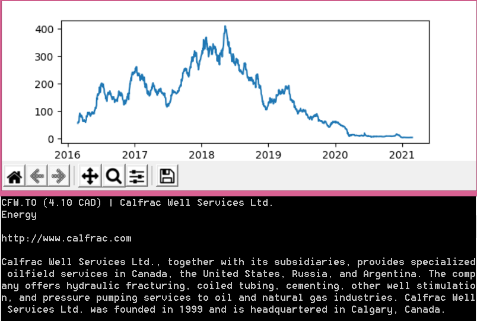

# CrosStonks
A simple tool that retrieves historical stonk data from thousands of companies, analyzes their stonk price and ranks them based on price-drop since 2019 and price increase in the last two months. It also shows graphs of the top-ranked stonks along with some basic information about the companies.

